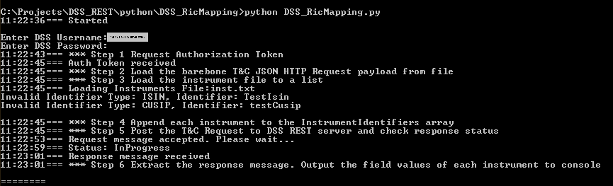
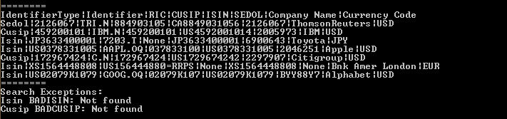

# Search RIC Using DSS REST API/Python  

## Introduction

Thomson Reuters [**DataScope Select (DSS)**](https://developers.thomsonreuters.com/datascope-select-dss) is an Internet-hosted product that offer  unparalleled access to global pricing, validated terms and conditions, historical data content, corporate actions, cross-reference data and entity data.
A [legacy SOAP-based API](https://developers.thomsonreuters.com/datascope-select-dss/datascope-select-soap-api) has been available for  a long time but is scheduled to be retired. Therefore, clients who still use SOAP-based API will need to migrate their applications to use REST API instead.


Thomson Reuters Enterprise Platform (**TREP**) system uses Reuters Instrument Code (**RIC**) as standard instrument identifier. However, many applications developed by clients use other types of identifier such as ISIN, SEDOL or CUSIP and need to map those identifiers to RIC when interfacing with TREP.  This article is to explain how we can retrieve the RIC of an instrument from other instrument types by implementing the DSS REST API with **Python** script and **JSON** HTTP requests. 


## Solution
This example demonstrates how we can take a list of instruments with various types of identifier such as ISIN, SEDOL or CUSIP and extract the RIC of the instruments from DSS. 
It follows the HTTP request processes illustrated in [REST API Tutorial7: On Demand T&C extraction](https://developers.thomsonreuters.com/datascope-select-dss/datascope-select-rest-api/learning?content=6002&type=learning_material_item) in the Developer Portal and implements them to a Python script.

The input instrument file may contain a list of instruments with several instrument code types like:

	Sedol,2126067
	Cusip,459200101
	Isin,JP3633400001
	Isin,US0378331005
	Cusip,172967424
	.
	.
	.	
The script loads the file and appends the instruments to the **InstrumentIdentifiers** array of the HTTP request body.


The JSON request body also defines a **ContentFieldNames** array that contains a list of fields.  The fields can be any field that is available in the **DSS Terms and Conditions (T&C)** report template. In this example, we are requesting fields: "**RIC, CUSIP, ISIN, SEDOL, Company Name, Currency Code**"

 

The process steps are:

1. Request Authorization Token
2. Create a bare-bone T&C JSON HTTP Request body by loading the body definitions from file **DSS_RicSearch.json**
3. Load the instrument file **inst.txt** to the instrument list
4. Append each instrument in the list to the **InstrumentIdentifiers** array of the Request body
5. **Post** the T&C JSON HTTP Request to DSS REST server and check response status
6. Parse the response message. Display the field values of each instrument to the console

When the extraction process is completed,The results, including the RIC column, are written to the console in csv format:

	IdentifierType|Identifier|RIC|CUSIP|ISIN|SEDOL|Company Name|Currency Code
	Sedol|2126067|TRI.N|884903105|CA8849031056|2126067|ThomsonReuters|USD
	Cusip|459200101|IBM.N|459200101|US4592001014|2005973|IBM|USD
	Isin|JP3633400001|7203.T|None|JP3633400001|6900643|Toyota|JPY
	Isin|US0378331005|AAPL.OQ|037833100|US0378331005|2046251|Apple|USD
	.
	.
	.

## Solution code

### Step 1 Request Authorization Token
Use a valid DSS user name and password to request an authentication token. The received token is required to attach to all following HTTP requests to the DSS server.


	_urlAuthToken = 'https://hosted.datascopeapi.reuters.com/RestApi/v1/Authentication/RequestToken'
	.
	.
	.	
    _header= {}
	_header['Prefer']='respond-async'
    _header['Content-Type']='application/json; odata.metadata=minimal'
    _data={'Credentials':{ 'Password':password,'Username':username } }
    _resp = requests.post( _urlAuthToken, json=_data, headers=_header )

	if _resp.status_code != 200:
        print('ERROR, ' +  'ERROR, Get Token failed with ' + str(_resp.status_code))
        sys.exit(-1)
	else:
         _jResp = _resp.json()
         _authToken = _jResp["value"]
         return _jResp["value"] 

### Step 2 Create a bare-bone T&C JSON HTTP Request body

The script uses JSON  **load()** function to load the JASON data from file **DSS_RicSearch.json** to the body of the JSON Request object **\_jReqBody** :

	
	_jsonFileName="DSS_RicSearch.json"
	.
	.
	.
	# Step 2
    print(timeNow() + "Loading Extraction request message body")
    _token = 'Token ' + authToken
    _jReqBody = {}
    with open(_jsonFileName, "r") as filehandle:
		_jReqBody=load( filehandle, object_pairs_hook=OrderedDict )
        #_jReqBody=load( filehandle )
		.
		.
		.

**Note:** Depending on the version of Python being installed, the JSON load() function may need to add an **object_pairs_hook=OrderedDict** argument to force the JSON object to maintain the order of attributes when sending the HTTP requests.

 
The file DSS_RicSearch.json is included in the article's download package. It contains the definitions of a bare-bone JSON terms & Conditions HTTP request body.:

	{
		"ExtractionRequest": {
            "@odata.type": "#ThomsonReuters.Dss.Api.Extractions.ExtractionRequests.TermsAndConditionsExtractionRequest",
            "ContentFieldNames": ["RIC", "CUSIP", "ISIN", "SEDOL", "Company Name", "Currency Code"],
            "IdentifierList": {
                "@odata.type": "#ThomsonReuters.Dss.Api.Extractions.ExtractionRequests.InstrumentIdentifierList",
                "InstrumentIdentifiers": []
            }
        }
	}

	


The **ContentFieldNames** array in the request body contains the fields that are expected to be returned from DSS server. They can be any fields defined in the DSS T&C report template. For the purpose of this demonstration, **RIC** must be minimally included in the ContentFieldNames array:


```
"ContentFieldNames": ["RIC", "CUSIP", "ISIN", "SEDOL", "Company Name", "Currency Code"]
```


The attribute of the the request body **InstrumentIdentifiers** is an empty array initially when the body was loaded from the file.:

```
"InstrumentIdentifiers": []
```

 It will be populated when the instruments are loaded from the instrument file in next step.


### Step 3 Load the instrument file to a list
Read the instrument file and append each instrument to the instrument list  . Log the entry as error if the value of IdentifierType is not Isin, Sedol or Cusip. 
	
	_instFilename = "inst.txt"
	.
	.
	.

	identifyTypes = [ 'Isin', 'Sedol', 'Cusip' ]
    
    _inFile = open(_instFilename, "r")
    for line in _inFile:
        line = line[:-1]
        lineElements = line.split(',')
        if len(_lineElements) == 2 :
            if _lineElements[0] in identifyTypes:
                _instElement = [_lineElements[0], _lineElements[1]]
                nstList.append(_instElement)

            else:
                print('Invalid Identifier Type: ' + _lineElements[0]
                                                  +  ", Identifier: "
                                                  +  _lineElements[1] )

**Note:** The sample instrument file **inst.txt** that is included in the article's download package contains two entries with invalid identifier type intentionally for testing purpose.  

### Step 4 Append each instrument to the **InstrumentIdentifiers** array of the Request body
Iterate through the instrument list. Append each instrument to the **InstrumentIdentifiers** array of the JSON Request body **\_jReqBody** created in **Step 2** 	

	for _inst in _instList:
        _jReqBody["ExtractionRequest"]["IdentifierList"]["InstrumentIdentifiers"]
                                    .append( { "IdentifierType": _inst[0], "Identifier": _inst[1] } )


### Step 5 Post the T&C HTTP Request to DSS REST server and check response status
Construct the Extraction request header and **Post** the T&C HTTP request to DSS server.

	_extractReqHeader = makeExtractHeader( authToken )
	#Step 5 Post the T&C Request to DSS REST server
    _resp = requests.post(_urlExtrations, data=None, json=_jReqBody,  headers=_extractReqHeader)
    if _resp.status_code != 200:
        if _resp.status_code != 202:
                message="Error: Status Code:" + str(_resp.status_code) + " Message:" + _resp.text
                raise Exception(message)

            print(timeNow() + "Request message accepted. Please wait...")

            # Get location URL from header
            _location = _resp.headers['Location']

            # Pooling loop to check request status every 2 sec.
            while True:
                _resp = get(_location, headers=reqHeader)
                _pollstatus = int(_resp.status_code)

                if _pollstatus==200:
                    break
                else:
                    print(timeNow() +  "Status:", _resp.headers['Status'])

                #wait 2 sec and re-request the status to check if it already completed
				sleep(_sleepTime) 

           
The normal response status codes should be either 200 or 202.

* Status **200** indicates the extraction was completed and application can go ahead retrieve data from the body of response message.

*  Status **202** indicates the HTTP Request has been accepted by the server but the extraction is not completed yet. In this case, a **"Location"** URL is returned in the response message and application should use the URL to retry periodically:

		_location = _resp.headers['Location']
		.
		.
		.
		_resp = get( _location, headers=_extractReqHeader )

 


* Other status codes indicate abnormal conditions and should be logged as errors:

		message="Error: Status Code:" + str(_resp.status_code) + " Message:" + _resp.text


### Step 6 Parse the response message. Display the field values of each instrument to the console

* Construct output data header string using the **ContentFieldNames** array of the response message
 
		_fieldNames = _jReqBody["ExtractionRequest"]["ContentFieldNames"]
   		_headerStr = "IdentifierType|Identifier"

    	for i in range(len(_fieldNames)):
	    	headerStr += "|" + str(_fieldNames[i])
 
	
* Iterate through the **value** array of the response body. Construct output string in **csv** file format. If an **Error** attribute presents in a returned instrument, append the instrument to the **\_ricExcepts** list

		for i in range(len(_jResp["value"])):
            if 'Error' in _jResp["value"][i]:
                _ricExcepts['RICException'].append( _jResp["value"][i] )
                continue

            _outStr = _jResp["value"][i]["IdentifierType"] + "|" + _jResp["value"][i]["Identifier"]
            for j in range(len( _fieldNames )):
                _outStr += "|" + str( _jResp["value"][i][_fieldNames[j]] )

            print( _outStr )


## Testing
To test the example, simply enter the following python command:
	
	python DSS_RicMapping.py

The Python script will prompt user to enter the DSS User ID and password then displays the steps of progress on the console:



When writing the output to the console, it first writes the list of field names as header. Followed by the data of each instrument. Finally, display any errors returned from the extracted data. The console output shows two invalid instruments that were added to the instrument file purposely:
     



## Disclaimer


The Python code in this article is for demonstration purposes only and is not intended to be used in production environment directly. The complete source code of this example can be downloaded from [DSS REST API Download](https://developers.thomsonreuters.com/datascope-select-dss/datascope-select-rest-api/downloads). A valid DataScope Select user account is required to execute the Python example code illustrated in this article, .
  