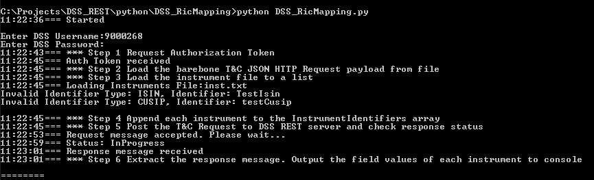
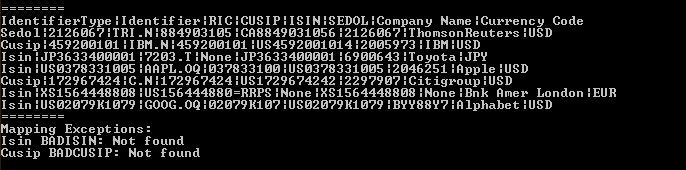

# Using DSS REST API/Python Mapping ISIN/CUSIP/SEDOL to RIC

## Introduction

[**DataScope Select (DSS)**](https://developers.thomsonreuters.com/datascope-select-dss) is an Internet-hosted product on the DataScope Select platform that provides REST API for unparalleled access to global pricing, validated terms and conditions, historical data content, corporate actions, cross-reference data and entity data.
A [legacy SOAP-based API](https://developers.thomsonreuters.com/datascope-select-dss/datascope-select-soap-api) has been for  a long time but is scheduled to be retired. Therefore clients who still use SOAP-based API may need to migrate their application to use REST API instead.


Thomson Reuters TREP system uses **RIC** (Reuters Instrument Code) as standard instrument identifier. However, many applications developped by clients use other types of identifier such as ISIN, SEDOL or CUSIP and need to map those identifiers to RIC when interfacing with TRAP.  This example demonstrates how to retrieve the RIC of an instrument from other instrument types by implementing the DSS REST API with Python script and JSON library. This example applies the steps provided in [DSS REST API tutorial](https://developers.thomsonreuters.com/datascope-select-dss/datascope-select-rest-api/learning?content=6002&type=learning_material_item) section which locates on Developer Portal to implement the Python example.


## Solution
This application implements DSS Rest REST API **On Demand** requests to extract DSS **Terms and Conditions(T&C)** data from DSS server. A list of Instrument codes with the corresponded instrument types are loaded from a plain text file and appended to the **InstrumentIdentifiers** array of the HTTP request body. The request body also defines a **ContentFieldNames** array that contains a list of fields such as RIC and other fields that the application may be interested from the T&C report template. The RIC of the instruments then can be extracted from the HTTP Response data.

The process steps are:

1. Request Authorization Token
2. Load the barebone T&C JSON HTTP Request payload from file
3. Load the instrument file to a list
4. Append each instrument in the list to the **InstrumentIdentifiers** array
5. **Post** the T&C Request to DSS REST server and check response status
6. Extract the response message. Display the field values of each instrument to console


## Solution code

### Step 1 Request Authorization Token
Use a valid DSS user name and password to request an authentication token. The received token is required to attach to all following requests to the DSS server.


	_urlAuthToken = 'https://hosted.datascopeapi.reuters.com/RestApi/v1/Authentication/RequestToken'
       _header= {}
	_header['Prefer']='respond-async'
    _header['Content-Type']='application/json; odata.metadata=minimal'
    _data={'Credentials':{ 'Password':password,'Username':username } }
    _resp = requests.post( _urlAuthToken, json=_data, headers=_header )

	if _resp.status_code != 200:
        print('ERROR, ' +  'ERROR, Get Token failed with ' + str(_resp.status_code))
        sys.exit(-1)
	else:
         _jResp = _resp.json()
         _authToken = _jResp["value"]
         return _jResp["value"] 

### Step 2 Load the barebone T&C JSON HTTP Request payload from file
The file **DSS_RicMapping.json** contains a barebone JASON T&C HTTP request body is available in the article download package.:

	{
		"ExtractionRequest": {
            "@odata.type": "#ThomsonReuters.Dss.Api.Extractions.ExtractionRequests.TermsAndConditionsExtractionRequest",
            "ContentFieldNames": ["RIC", "CUSIP", "ISIN", "SEDOL", "Company Name", "Currency Code"],
            "IdentifierList": {
                "@odata.type": "#ThomsonReuters.Dss.Api.Extractions.ExtractionRequests.InstrumentIdentifierList",
                "InstrumentIdentifiers": []
            }
        }
	}

	


The **ContentFieldNames** array in the request body contain the fields that will be returned from DSS server. The fields can be any field of defined in the DSS T&C report template but for the purpose of this example, **RIC** must be minimally included in the ContentFieldNames array:


```
"ContentFieldNames": ["RIC", "CUSIP", "ISIN", "SEDOL", "Company Name", "Currency Code"]
```


**InstrumentIdentifiers** is an empty array initially and will be populated when the instruments are loaded from the instrument file in the later step:

```
"InstrumentIdentifiers": []
```

	# Step 2
    print(timeNow() + "Loading Extraction request message body")
    _token = 'Token ' + authToken
    _jReqBody = {}
    with open(_jsonFileName, "r") as filehandle:
		_jReqBody=load( filehandle, object_pairs_hook=OrderedDict )
        #_jReqBody=load( filehandle )

**Note:** Depending on the version of Python being installed, the JSON load() function may need to add an **object_pairs_hook=OrderedDict** argument to force JSON to maintain the order of attributes when sending the HTTP requests.


### Step 3 Load the instrument file to a list
Read the instrument file and append each instrument to the instrument list  . Log as error if the value of IdentifierType is not Isin, Sedol or Cusip.


	identifyTypes = [ 'Isin', 'Sedol', 'Cusip' ]
    
    _inFile = open(_instFilename, "r")
    for line in _inFile:
        line = line[:-1]
        lineElements = line.split(',')
        if len(_lineElements) == 2 :
            if _lineElements[0] in identifyTypes:
                _instElement = [_lineElements[0], _lineElements[1]]
                nstList.append(_instElement)

            else:
                print('Invalid Identifier Type: ' + _lineElements[0]
                                                  +  ", Identifier: "
                                                  +  _lineElements[1] )

**Note:** The instrument file included in the download source code package contains two entries with invalid identifier type intentionally for testing purpose.  

### Step 4 Append each instrument to the **InstrumentIdentifiers** array
Iterate through the instrument list. Append each element of the list as a JSON object to the **InstrumentIdentifiers** of the JSON Request body **\_jReqBody** created in **Step 2** 	

	for _inst in _instList:
        _jReqBody["ExtractionRequest"]["IdentifierList"]["InstrumentIdentifiers"]
                                    .append( { "IdentifierType": _inst[0], "Identifier": _inst[1] } )


### Step 5 Post the T&C Request to DSS REST server and check response status
Construct the Extraction request header and **Post** the T&C request to DSS server and poll the request status from DSS server

	_extractReqHeader = makeExtractHeader( authToken )
	#Step 5 Post the T&C Request to DSS REST server
    _resp = requests.post(_urlExtrations, data=None, json=_jReqBody,  headers=_extractReqHeader)
    if _resp.status_code != 200:
        if _resp.status_code != 202:
                message="Error: Status Code:" + str(_resp.status_code) + " Message:" + _resp.text
                raise Exception(message)

            print(timeNow() + "Request message accepted. Please wait...")

            # Get location URL from header
            _location = _resp.headers['Location']

            # Pooling loop to check request status every 2 sec.
            while True:
                _resp = get(_location, headers=reqHeader)
                _pollstatus = int(_resp.status_code)

                if _pollstatus==200:
                    break
                else:
                    print(timeNow() +  "Status:", _resp.headers['Status'])

                #wait 2 sec and re-request the status to check if it already completed
				sleep(_sleepTime) 

           
The normal response status codes should be either 200 or 202. Status **202** indicates the HTTP Request has been accepted by the server. An URL is returned by this response code and application should use the URL to retrieve the data again with the statement:

	_resp = get( _location, headers=_extractReqHeader )

 Status **200** indicates the request was completed and application can go ahead extract data from the body of response message.

Other status codes indicate errors and should be logged as error:

	message="Error: Status Code:" + str(_resp.status_code) + " Message:" + _resp.text


### Step 6 Extract the response message. Display the field values of each instrument to console

* Construct output data header string using the **ContentFieldNames** array of the response message
 
		_fieldNames = _jReqBody["ExtractionRequest"]["ContentFieldNames"]
   		_headerStr = "IdentifierType|Identifier"

    	for i in range(len(_fieldNames)):
	    	headerStr += "|" + str(_fieldNames[i])
 
	
* Iterate through the **value** array of the response body. Construct output string as **csv** file format using the **IdentifierType** and **Identifier** values of each value array elements. If an **Error** attribute presents in a returned instrument, append the instrument to the **\_ricExcepts** list

		for i in range(len(_jResp["value"])):
            if 'Error' in _jResp["value"][i]:
                _ricExcepts['RICException'].append( _jResp["value"][i] )
                continue

            _outStr = _jResp["value"][i]["IdentifierType"] + "|" + _jResp["value"][i]["Identifier"]
            for j in range(len( _fieldNames )):
                _outStr += "|" + str( _jResp["value"][i][_fieldNames[j]] )

            print( _outStr )


## Testing
To test the example, simply enter the following python command:
	
	python DSS_RicMapping.py

The Python script will prompt user to enter the DSS User ID and password then displays the steps of progress to the console:



When writing the outputto the console, it first writes the header lines with the field names. Follow by the extracted data of each instrument. Finally, display any error returned from the extracted data. The **Mapping Exceptions** list shows two invalid instruments that were added to the instrument file purposely:
     



## Disclaimer


This Python code in this article is for demonstration purposes only and is not intended to be used in production environment directly. The complete source code of this example can be downloaded from [DSS REST API Download](https://developers.thomsonreuters.com/datascope-select-dss/datascope-select-rest-api/downloads). To execute the Python example code illustrated in this article, a valid TR DataScope Select user account/password is required.
  
